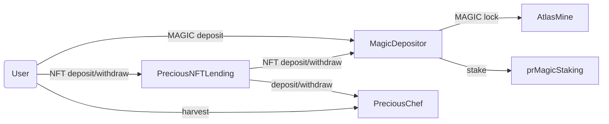
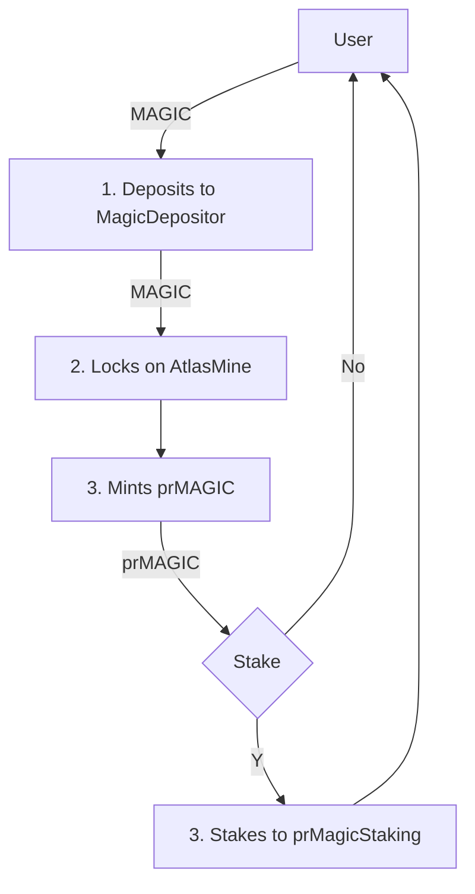
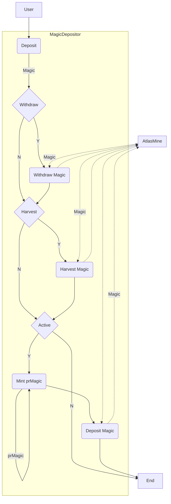

# Precious Finance Smart Contracts

## Overview

Precious utilizes the convex-model to create the most optimized staking avenue for MAGIC by creating a liquid staking derivative (Convex-style) and accumulation of some key NFTs (bonding event).

## Precious Contracts

Smart contract function documentation can be found in [docs/](https://github.com/advancedblockchain/precious/tree/main/docs)

### MagicDepositor

`MagicDepositor` allows users deposit any amount of Magic tokens and receive back prMagic tokens in exchange of providing Magic. Magic tokens deposited during an epoch are deposited into `AtlasMine`. `MagicDepositor` can hold `Treasure` and `Legions` nfts and deposit to `AtlasMine` to boot rewards. Harvested Magic rewards from AtlasMine splits into treasury and `prMagicStaking` contract.

### prMagicStaking

Like `Convex` users should deposit the `prMagic` tokens into `prMagicStaking` contract to get the Magic token rewards.

### prMagic

Locked Magic token (similar to `cvxCRV`).

### PreciousNFTLending

NFT lending contract for Treasure and Legion tokens for APY boosting on AtlasMine staking.

### PreciousChef

Precious token distribution contract based on boosting from PreciousNFTLending

## Token & Fund Flow Diagrams

### High-level architecture



### Token Flow Diagram



### Fund Flow Diagram



## Project Setup

The following are the commands to set up the environment.

### Clone the Precious:

In the directory of your choice run the command:

```
    git clone git@github.com:advancedblockchain/precious.git
```

### Install dependencies:

```
    $ cd precious
    $ yarn(or npm install)
```

### Create Environment Variable

Create `.env` file in the root directory and the following variable:

```
    NODE_URL = ALCHEMY_ARBITRUM_MAINNET
    MAINNET_PRIVKEY = YOUR_PRIVATE_KEY
    TESTNET_PRIVKEY = YOUR_PRIVATE_KEY
```

### Compile

Compile the smart contracts with Hardhat:

```
    $ yarn compile
```

### Test

Run the hardhat contract tests:

```
    $ yarn test
```

### Configuration for Precious Deployment

Already set predefined params that will be needed for precious mainnet deployment .
But you may change any params under util/constant.ts .

1.  For deployment of MagicDepositorContract :(deploy/hardhat/006_deploy_magic_depositor.ts)

        Set magicToken address,prMagic Token address,atlasMine contract address,
            treasure contract address,legion contract address
        Set all above params , In util/constant.ts(We already set these contract address)

2.  For deployment of RewardPool:(deploy/hardhat/007_deploy_rewardpool.ts)

        Set StakingToken as prMagicToken , RewardToken as magicToken and operator as magicDepositorContract address

3.  For deployment of LendingAuctionNft:(deploy/hardhat/008_deploy_lendingAuctionNFT.ts)

        Set treasure,legion and atlasmine contract address and after that call
        setMagicDepositor(magicDepositorAddress)

### Precious Deployment on arbitrum mainnet

It will deploy Precious System on ArbitrumMainnet

```
   $ yarn deploy:live

```
