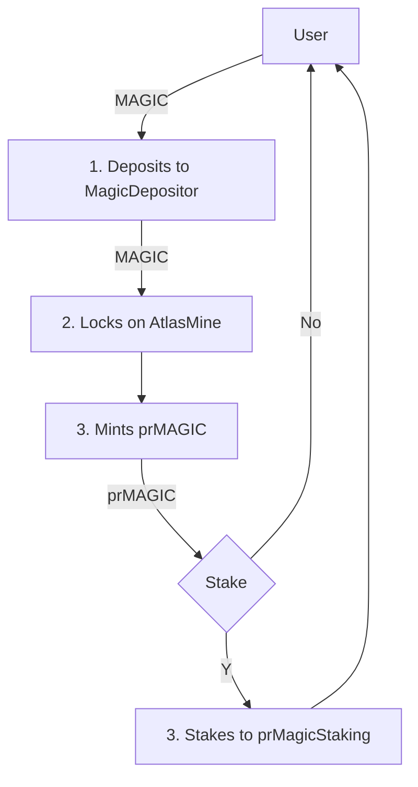
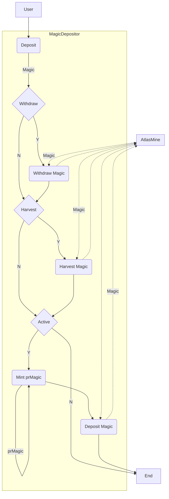

# Precious Finance Smart Contracts

## Overview

Precious utilizes the convex-model to create the most optimized staking avenue for MAGIC by creating a liquid staking derivative (Convex-style) and accumulation of some key NFTs (bonding event).

## Precious Contracts

### MagicDepositor

`MagicDepositor` allows users deposit any amount of Magic tokens and receive back prMagic tokens in exchange of providing Magic. Magic tokens deposited during an epoch are deposited into `AtlasMine`. `MagicDepositor` can hold `Treasure` and `Legions` nfts and deposit to `AtlasMine` to boot rewards. Harvested Magic rewards from AtlasMine splits into treasury and `prMagicStaking` contract.

### prMagicStaking

Like `Convex` users should deposit the `prMagic` tokens into `prMagicStaking` contract to get the Magic token rewards.

### prMagic

Locked Magic token (similar to `cvxCRV`).

## Token & Fund Flow Diagrams

### Token Flow Diagram



### Fund Flow Diagram



## Project Setup

The following are the commands to set up the environment.

### Clone the Precious:

In the directory of your choice run the command:

```
    git clone git@github.com:advancedblockchain/precious.git
```

### Install dependencies:

```
    $ cd precious
    $ yarn(or npm install)
```

### Create Environment Variable

Create `.env` file in the root directory and the alchemy arbitrum url:

```
    NODE_URL=
```

### Compile

Compile the smart contracts with Hardhat:

```
    $ yarn compile
```

### Test

Run the Mocha tests:

```
    $ yarn test
```
